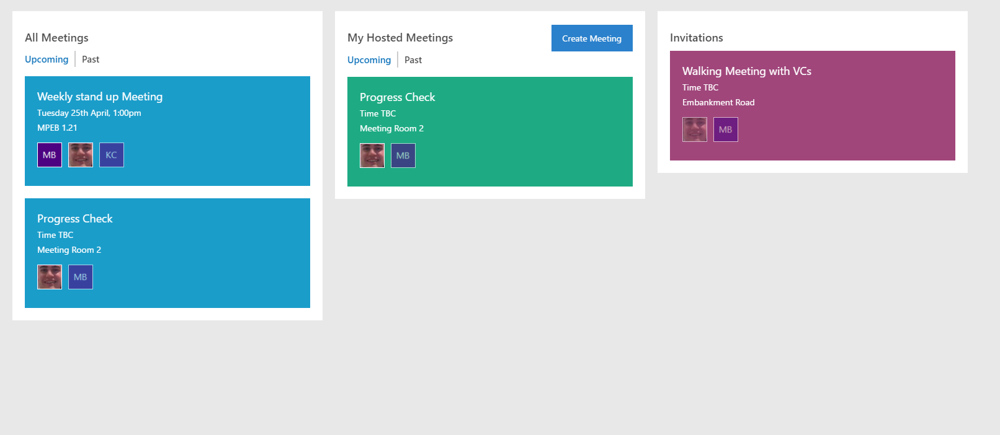
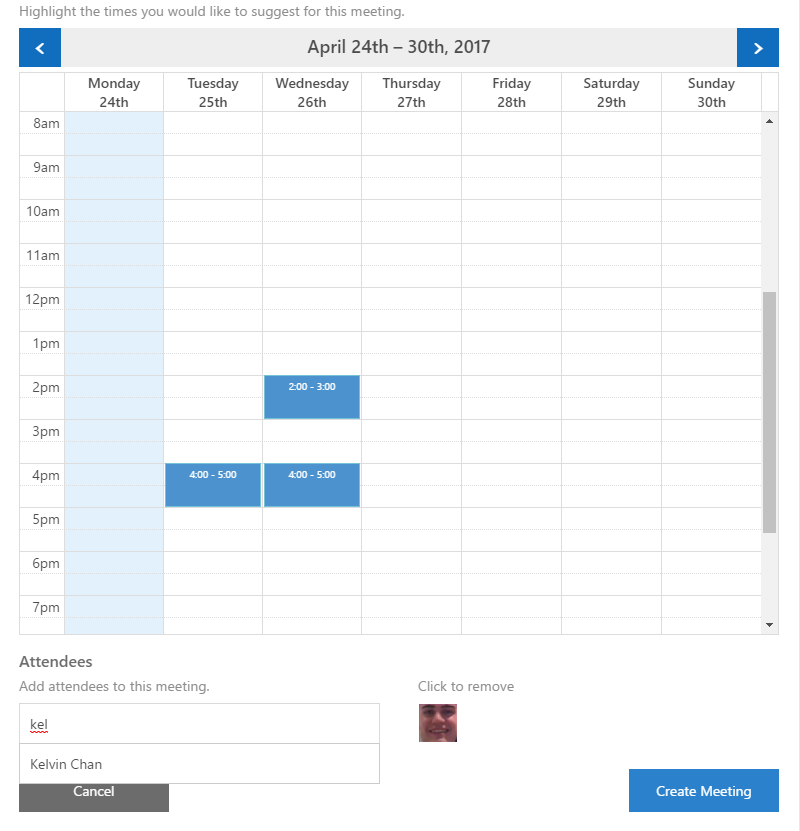
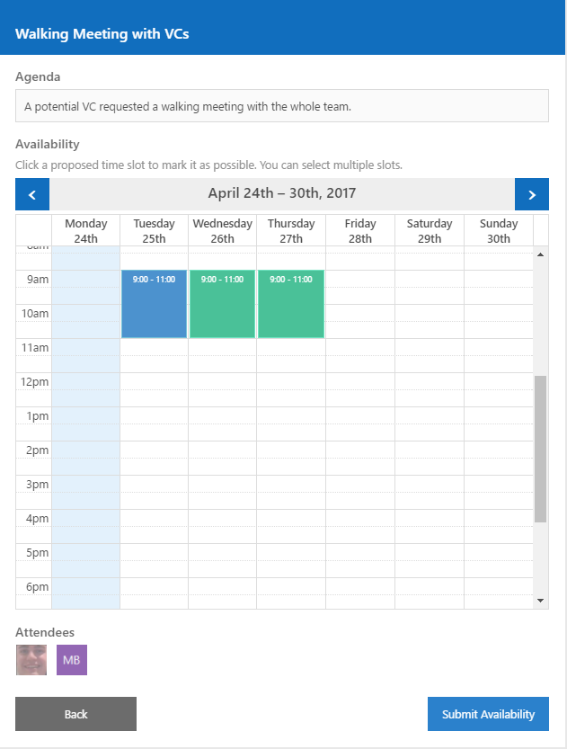
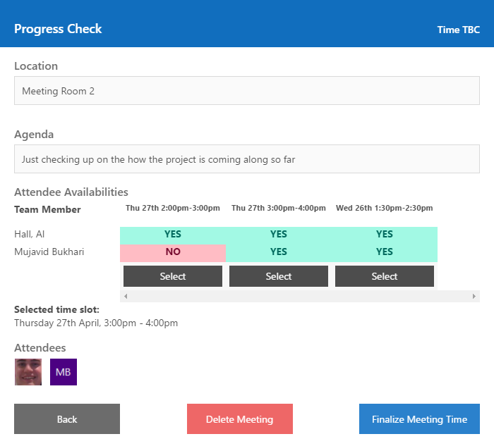

# Meetings

Meetings helps busy teams organise meetings around everybody's already packed schedules. Meetings is the all in one solution to everything meetings: organise new meetings, respond to invitations, revisit past meetings.

## Everything you need in a simple dashboard view

All of the vital information can be seen at a glance in the dashboard view.

## Create a meeting

Enter all of the meetings details, select potential timeslots using a drag-to-select calendar and invite your team mates.

## Respond to invitations

Just select the timeslots you can attend and leave the ones you can't. Easy!

## Finalize the meeting time

When everyone has replied, you can select the final time for the meeting.

## Non-votable meetings

Alternatively, if you want to select the time of the meeting when you create it, simply only add one time slot.

## Learn more

The [source](https://github.com/mujavidb/visual-studio-meeting-scheduler) for this extension is on GitHub. 
